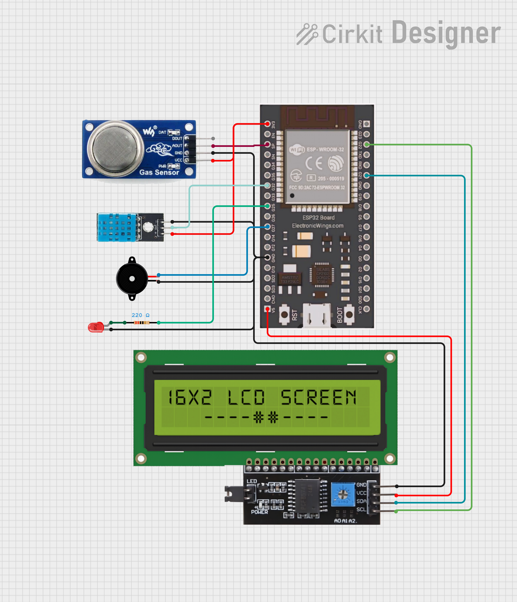
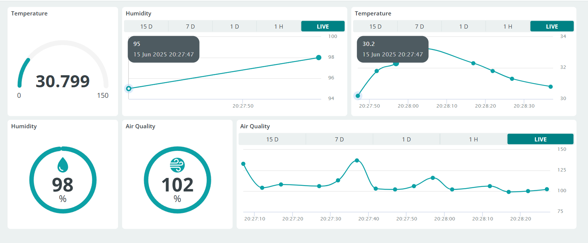

# 🌫️ Air Monitoring System with ESP32 + Arduino IoT Cloud + Alarm

A smart **Air Quality Monitoring System** using an **ESP32**, **DHT11 sensor**, **MQ135 air quality sensor**, and **LCD 16x2 (I2C)**. The system monitors temperature, humidity, and air quality (PPM), displays real-time data on an LCD, and syncs with the **Arduino IoT Cloud**. When the air quality exceeds a defined threshold, the system triggers a **visual and sound alert** using an LED and buzzer.

## 🚀 Features

- 📡 Send sensor data (Temperature, Humidity, Air Quality) to Arduino IoT Cloud.
- 📟 Display real-time data on 16x2 I2C LCD.
- 🔴 **LED and Buzzer alert** when air quality exceeds safe threshold (e.g., PPM > 300).
- 🌐 WiFi connectivity and remote dashboard.
- 🪛 Fully non-blocking using `millis()` (no `delay()`).
- 🔁 Periodic updates every 5 seconds.
- 📊 Serial debug output for development and troubleshooting.

## 🧰 Hardware Requirements

- ESP32 Dev Board
- DHT11
- MQ135
- LCD 16x2 I2C
- LED (optional)    
- Buzzer (passive)

## 🔌 Circuit Diagram

## ⚙️ Software Setup

### 1. Install Libraries
Install the following libraries via Library Manager in Arduino IDE:
- `DHT sensor library` by Adafruit
- `LiquidCrystal_I2C` by Frank de Brabander (or compatible)
- `ArduinoIoTCloud` and dependencies

### 2. Configure Arduino IoT Cloud
- Create a new Thing on [Arduino IoT Cloud](https://create.arduino.cc/iot).
- Add variables: `temperature`, `humidity`, `air_quality` (all `float`, set as `ReadOnly`).
- Include the generated `thingProperties.h` and `arduino_secrets.h` files.

## 🧩 Future Improvements
- 🎵 Add multiple alarm tones (like SOS).
- 📤 Push notification to mobile when warning is triggered.
- 📈 Log historical data to InfluxDB or Google Sheets.
- 🔄 Add button to manually reset alarms or mute buzzer.

## 📸 Demo

📽 [Watch demo here](https://drive.google.com/file/d/1EUx8b2wGIt7_3FOnLddAI_VvBxOjAEsH/view?usp=sharing)

