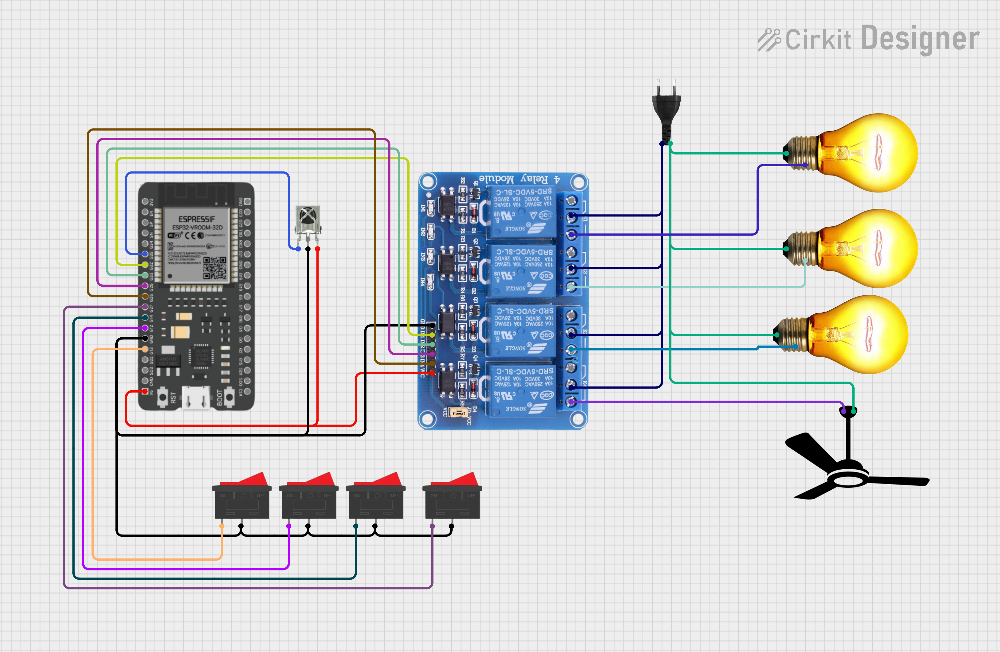
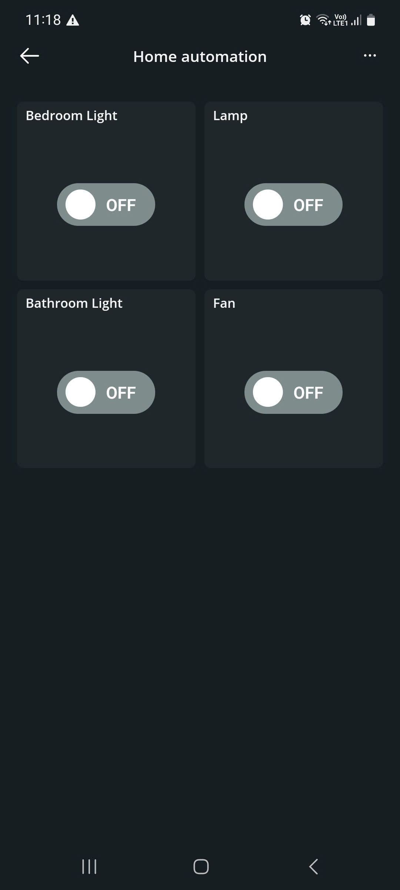
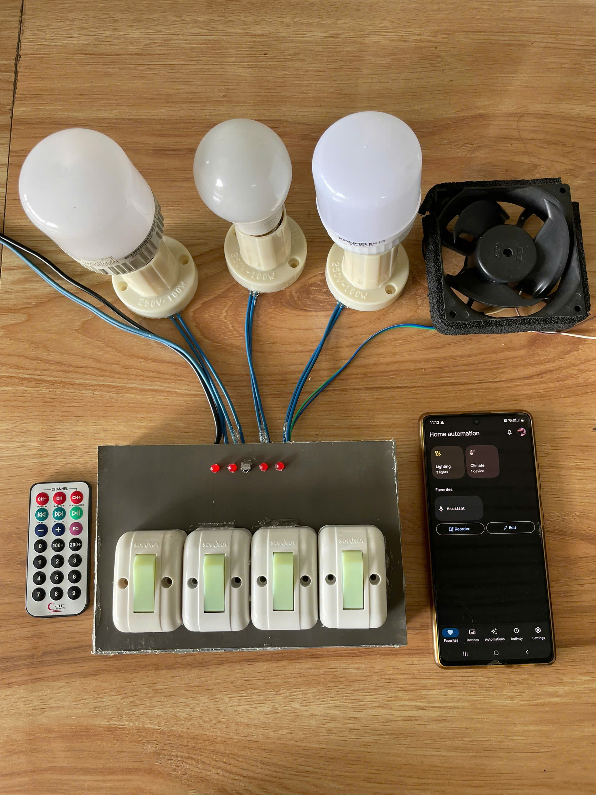

# 🏠 Smart Room Automation with ESP32 & Google Assistant

> A smart room project using ESP32 to control 4 real-world devices with:
> - Remote control via Arduino IoT Cloud
> - Manual control via physical switches
> - Voice control using Google Assistant

---

## 🚀 Features

- ✅ Control 4 electrical devices (light, fan, socket, desk lamp) via smartphone, button, or voice.
- ✅ Real-time state sync between Arduino IoT Cloud and Google Assistant.
- ✅ Manual override supported without desynchronizing the cloud.
- ✅ Seamless integration with Google Home.

---

## 🔧 Hardware Used

| Component             | Quantity |
|-----------------------|----------|
| ESP32 Dev Module      | 1        |
| 4-Channel Relay Module| 1        |
| Switch                | 4        |
| 5V Power Supply (≥2A) | 1        |
| Wires, Breadboard     | Optional |

---

## 🔌 Relay Device Mapping

| Relay | Device             | Google Home Name   |
|-------|--------------------|---------------------|
| R1    | Bedroom Ceiling Light | `Bedroom Light`     |
| R2    | Lamp          | `Lamp`       |
| R3    | Bathroom Light       | `Bathroom Light`    |
| R4    | Standing Fan         | `Fan`         |

---

## 🗣 Google Assistant Voice Control

You can say commands like:
- "Hey Google, turn on **bedroom light**"
- "Ok Google, switch off **bedroom fan**"
- Automate with routines via Google Home app

---

## 🌐 Circuit Diagram

---

## 🔗 Demo

📽 [Watch demo video here](https://drive.google.com/file/d/1Mt9BZTUqXCrcm7yEpY2803BONbBJRyb7/view?usp=sharing)

---

## 📲 Technologies Used

- [Arduino IoT Cloud](https://create.arduino.cc/iot)
- [ESP32 Dev Module](https://github.com/espressif/arduino-esp32)
- [Google Assistant](https://assistant.google.com)
- Arduino IDE

---

## 📁 Project File

- `home-automation-with-google-assistant.ino` – Main firmware for ESP32

---

## 🧠 Connect to Google Assistant

1. Create your "Thing" on [Arduino IoT Cloud](https://create.arduino.cc/iot)
2. In the Google Home app: Add → "Works with Google" → Search for **Arduino IoT Cloud**
3. Log in with the same Arduino account
4. Assign each cloud variable to a Google Home device
5. Test voice command: "Ok Google, turn on lamp"

---

## ✨ Suggested Improvements

- Add DHT11 for auto fan control based on temperature
- Add light sensor to auto control lights
- Display device status on an LCD
- Integrate infrared remote control

---

## 👨‍💻 Author

- 💡 Project by ImGhostCode
- 📧 Contact: imghostcode@gmail.com
