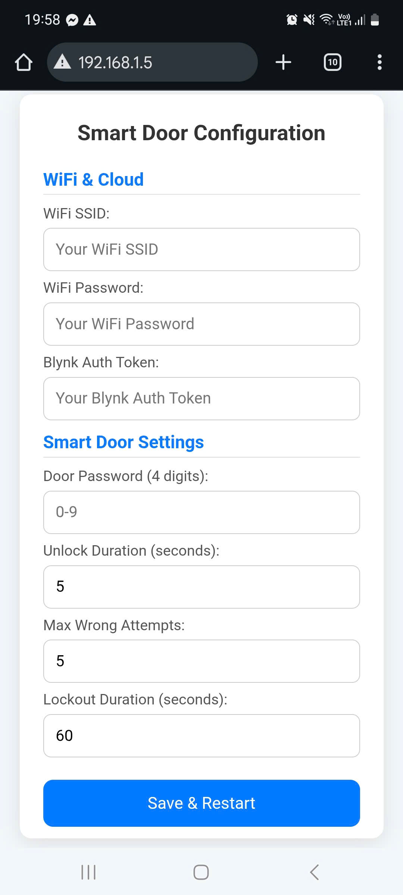
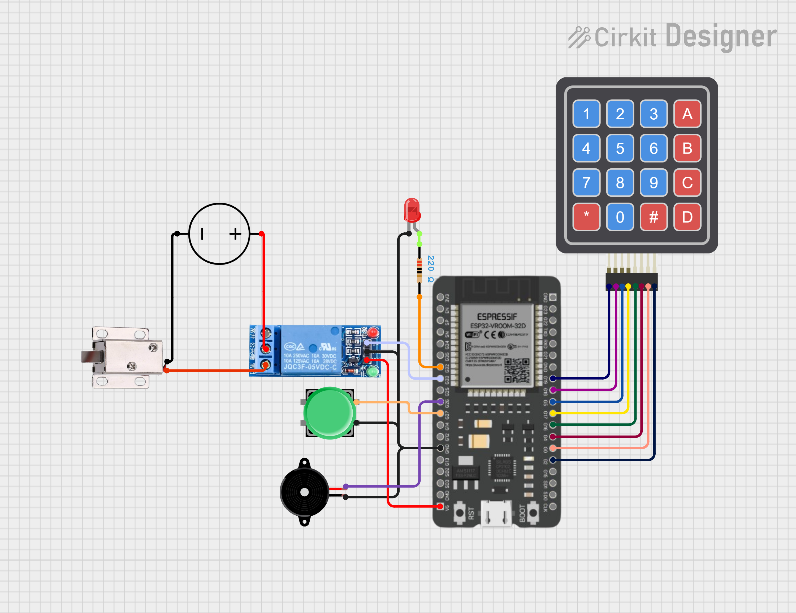
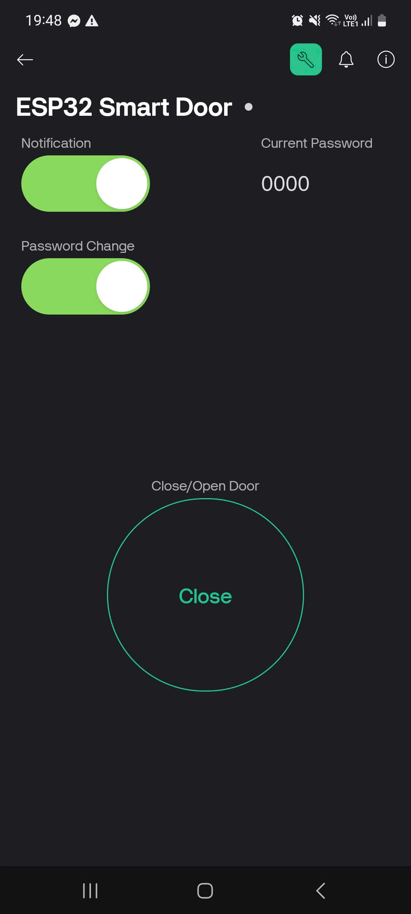
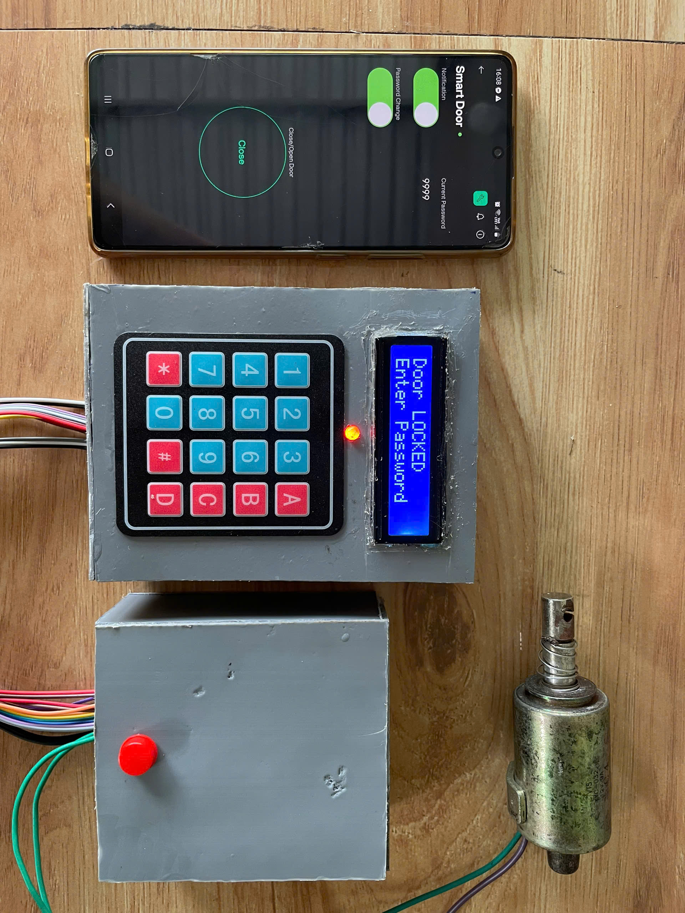

# 🔐 Smart Door System

A smart door access control system built using ESP32, allowing password-protected access and remote monitoring using Blynk. The system includes a mobile-friendly web configuration page for WiFi and door settings, without the need to hardcode any credentials.

---

## 🚀 Features

- 🔒 Password-protected door unlock (4-digit)
- 🔑 Change password via keypad
- ⛔ Lockout after multiple failed attempts
- 🚨 Send alert notifications when:
  - Password is changed
  - Too many wrong attempts are made
- 🔔 Enable/Disable notification, password change
- 🌐 Web-based configuration interface (mobile-friendly)
- 📱 Blynk integration

---

## 🔧 Hardware Requirements

- ✅ ESP32 Dev Board
- ✅ Relay Module (to control the door lock)
- ✅ Buzzer (for feedback on success/failure)
- ✅ Power supply (e.g., 5V/2A)
- ✅ Door lock (electromagnetic or motorized)
- ✅ Keypad 4x4, LCD I2C, button, led, wires

---

## 🌐 Web Configuration Page

Once the ESP32 starts (and cannot connect to WiFi), it opens an Access Point. Connect to it and access the configuration page (usually at `192.168.4.1`):



📝 After submitting the form, the system saves configuration and restarts automatically.

---

## 🛠 How to Use

1. Flash the code (`smart-door-system.ino`) to ESP32 using Arduino IDE.
2. Connect ESP32 to power.
3. ESP32 will start as a WiFi hotspot (e.g., `SmartDoor-XXXX`).
4. Use your phone/laptop to connect to the AP.
5. Access `192.168.4.1` in a browser.
6. Enter all settings and save.
7. Device will reboot and try to connect to the configured WiFi.

---

## 🌐 Circuit Diagram



---

## 📁 File Structure

```bash
smart-door-system/
├── smart-door-system.ino       # Main firmware code
├── README.md                   # Project documentation
```

---

## 🧠 Future Improvements

- Add support for OTA updates
- Integrate with MQTT or Home Assistant
- Use RFID or fingerprint sensor
- Store logs of access attempts

---

## 📜 License

This project is licensed under the MIT License — feel free to use and modify!

---

## 🙌 Acknowledgements

- [Blynk IoT Platform](https://blynk.io/)
- [ESPAsyncWebServer](https://github.com/me-no-dev/ESPAsyncWebServer)
- [ESP32 Arduino Core](https://github.com/espressif/arduino-esp32)

---

## 📸 Demo Screenshots

📽 [Watch demo video here](https://drive.google.com/file/d/1N_zpOkVyUN4uL2yqLFwXPPaY2ifyVBCL/view?usp=sharing)

<div>


</div>

---

Happy Building! 🚪✨